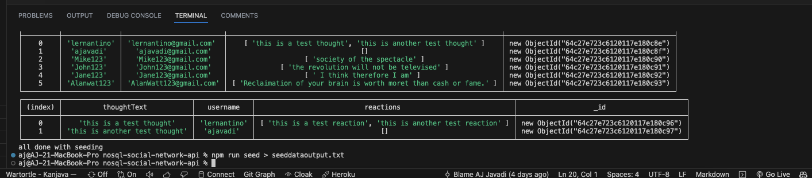

# NoSQL Social Network API

## Description

This is a social network API built with MongoDB, Express,  and Mongoose. It allows users to create a user profile, add friends, add thoughts, and react to thoughts. Users can also add reactions to other users' thoughts.

The goal for this project was to create all of the API routing for the back-end and test it using Insomnia Core.

The Demo Walkthrough video is available [here](https://watch.screencastify.com/v/COU4wWvHZa8wzLo3LcXO).


## Table of Contents (Optional)

If your README is long, add a table of contents to make it easy for users to find what they need.

- [NoSQL Social Network API](#nosql-social-network-api)
  - [Description](#description)
  - [Table of Contents (Optional)](#table-of-contents-optional)
  - [Installation / Seed Data](#installation--seed-data)
  - [Usage](#usage)
    - [Seed Data](#seed-data)
  - [Credits](#credits)
  - [License](#license)
  - [Badges](#badges)
  - [Features](#features)
  - [How to Contribute](#how-to-contribute)
  - [Walkthrough Video](#walkthrough-video)

## Installation / Seed Data

To install this project, clone the repository and run `npm install` to install the dependencies (nodejs, nodemon, mongoose, express, moment, and dotenv).

* Install Depencies
```sh
npm install
```sh

* Seed Data
```sh
npm run seed
```
  * Seed Data Output 
    

* Start Server
```sh
npm start
```


## Usage

 
 
 


### Seed Data
 
 ```sh 
 npm run seed > seeddataoutput.txt 
```


## Credits

- AJ Javadi

## License

- MIT License
---


## Badges


## Features
- Create a user profile
- Create thoughts
- Add friends
- Add Reactions to thoughts
  


## How to Contribute

Please contact me if you would like to contribute to this project.

- email: amirjavadi@gmail.com
- github: [oshkoshbagoshh](https://github.com/oshkoshbagoshh)
- linkedIn: [AJ Javadi](https://www.linkedin.com/in/ajavadi25/)
- 

## Walkthrough Video

[Demo Video](https://watch.screencastify.com/v/COU4wWvHZa8wzLo3LcXO)

